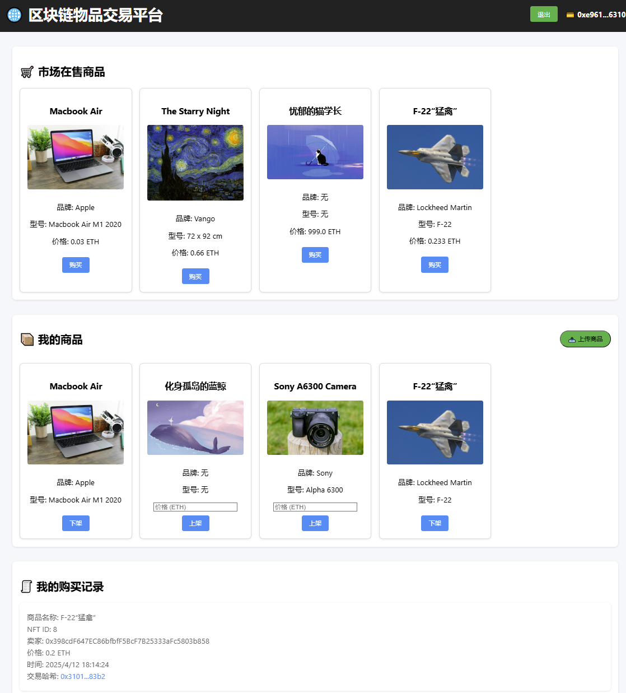

# 基于区块链的物品交易平台(Blockchain-Based Item Trading Platform)



一个基于以太坊区块链的分布式物品交易平台，使用智能合约实现商品铸造、上架、交易等功能，结合IPFS实现去中心化存储。  
**Refer to [README_en.md](./README_en.md) for English** 

## 项目演示Demo 
https://nftmarket-kangning.netlify.app/  
📌 注意事项  
- 请先安装Metamask钱包拓展
- 并保证钱包地址位于Sepolia测试网络

## 🌟 功能特性

- **钱包集成**  
  🔐 支持MetaMask钱包连接，实现安全区块链交互
- **商品管理**  
  📤 上传商品至IPFS并铸造为ERC721 NFT  
  🛒 商品上架/下架功能  
  💸 以太坊支付购买商品
- **交易追踪**-  
  📜 实时查看购买/出售记录  
  🔗 支持Etherscan交易链接查询
- **去中心化存储**  
  🌐 使用Pinata网关将商品图片/元数据存储至IPFS

## 🛠 技术栈

**前端**  


**区块链**  


**服务端**  


## 🚀 快速部署

### 前置要求
- [MetaMask](https://metamask.io/) 浏览器扩展
- [Netlify](https://www.netlify.com/)账号
- [Pinata](https://pinata.cloud/) API密钥

### 部署步骤

1. **克隆仓库**
```bash
git clone https://github.com/kangningyuan/NFT_marketplace.git
cd NFT_marketplace
```

2. **部署智能合约**  
使用Remix IDE部署[Marketplace.sol](./sol/Marketplace.sol)到以太坊测试网（推荐使用Sepolia），并记录合约地址、ABI。  
然后进入script.js，将合约ABI与合约地址替换。  
```javascript
const contractABI = ...; //合约ABI
const contractAddress = ...; // 合约地址
```

3. **启动Github Page**  
完成Step2替换后，将文件上传到你的GitHub项目中，启用Github Page，选择默认/root作为主页。

4. **Pinata IPFS API**  
进入[Pinata网站](https://pinata.cloud/)，注册账号并生成一个API密钥，记住其中的**API key**和**API secret**


5. **部署到Netlify**   
进入[Netlify网站](https://www.netlify.com/)，注册账号并与你的Github账户绑定后，启用deploy on Github，选择本项目  
在Netlify控制台设置环境变量：
```env
PINATA_API_KEY=your_pinata_key
PINATA_SECRET_API_KEY=your_pinata_secret
```

## 🖥 使用指南

1. **连接钱包**  
  点击"连接钱包"按钮，授权MetaMask连接

2. **上传商品**  
  - 填写商品信息
  - 上传图片文件
  - 确认交易铸造NFT

3. **市场交易**  
  - 浏览在售商品
  - 点击购买并确认交易
  - 在"我的商品"管理上架状态

4. **查看记录**  
  - 实时追踪购买历史
  - 通过Etherscan hash链接查看链上详情

## 📌 注意事项

- 使用Sepolia测试网络进行开发测试
- 交易需要支付Gas费（获取测试ETH可使用[Sepolia Faucet](https://sepoliafaucet.com/)）
- 图片上传依赖Pinata服务，需确保API密钥有效


## 📜 许可证
任何问题请联系  **KangningYuan**  
📧: yuankangning@outlook.com  
[MIT License](LICENSE) © 2025 KangningYuan