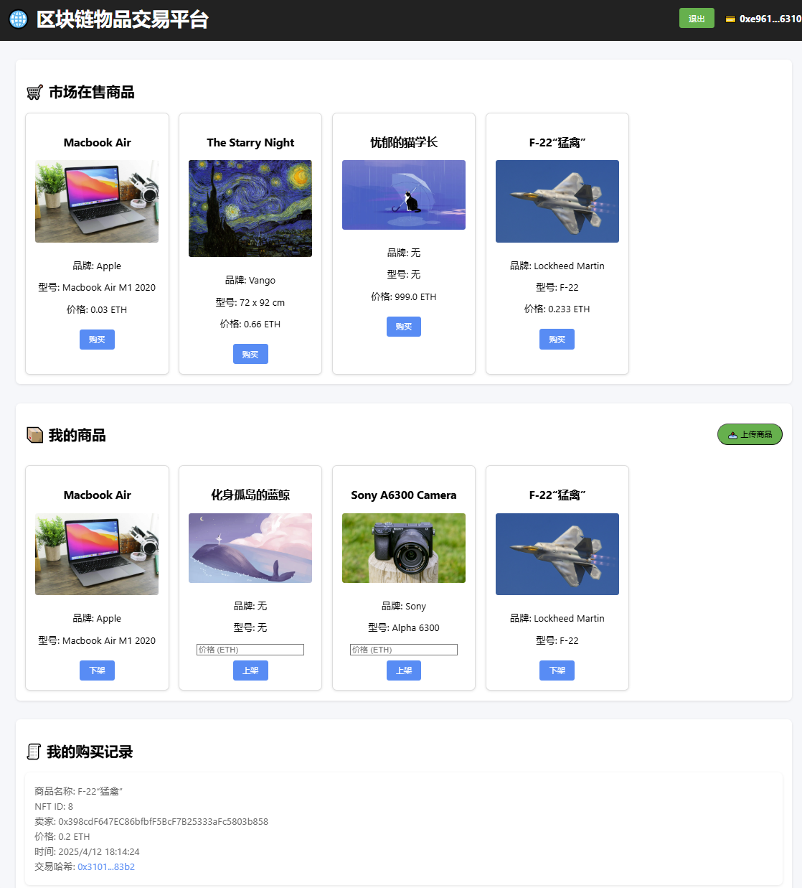

# Blockchain-Based Item Trading Platform



A decentralized item trading platform built on Ethereum blockchain, utilizing smart contracts for product minting, listing, and trading, combined with IPFS for decentralized storage.

## Live Demo
https://nftmarket-kangning.netlify.app/  
📌 Important Notes  
- Install [MetaMask](https://metamask.io/) browser extension first  
- Ensure your wallet is connected to Sepolia Test Network

## 🌟 Key Features

- **Wallet Integration**  
  🔐 Supports MetaMask wallet integration for secure blockchain interactions
- **Product Management**  
  📤 Upload products to IPFS and mint as ERC721 NFTs  
  🛒 List/Unlist products  
  💸 Purchase items with Ethereum
- **Transaction Tracking**  
  📜 Real-time purchase/sales history  
  🔗 Etherscan transaction link verification
- **Decentralized Storage**  
  🌐 Store product images/metadata on IPFS via Pinata gateway

## 🛠 Technology Stack

**Frontend**  


**Blockchain**  


**Backend Services**  


## 🚀 Quick Deployment

### Prerequisites
- [MetaMask](https://metamask.io/) browser extension
- [Netlify](https://www.netlify.com/) account
- [Pinata](https://pinata.cloud/) API keys

### Deployment Steps

1. **Clone Repository**
```bash
git clone https://github.com/kangningyuan/NFT_marketplace.git
cd NFT_marketplace
```

2. **Deploy Smart Contract**  
Deploy [Marketplace.sol](./sol/Marketplace.sol) to Ethereum testnet (recommend Sepolia) using Remix IDE. Update contract details in [script.js](./script.js):
```javascript
const contractABI = ...; // Contract ABI
const contractAddress = ...; // Deployed contract address
```

3. **Enable GitHub Pages**  
After updating contract details, push to your GitHub repository and enable GitHub Pages with **/root** directory.

4. **Pinata IPFS Setup**  
Create API keys at [Pinata](https://pinata.cloud/) and note the **API Key** and **API Secret**

5. **Netlify Deployment**  
Connect your GitHub account to [Netlify](https://www.netlify.com/), select this repository, and set environment variables:
```env
PINATA_API_KEY=your_pinata_key
PINATA_SECRET_API_KEY=your_pinata_secret
```

## 🖥 User Guide

1. **Connect Wallet**  
Click "Connect Wallet" to authorize MetaMask connection

2. **Upload Product**  
- Fill product details  
- Upload image file  
- Confirm transaction to mint NFT

3. **Marketplace Trading**  
- Browse listed items  
- Click "Buy" and confirm transaction  
- Manage listings in "My Items" section

4. **Transaction History**  
- Track purchase records in real-time  
- Verify transactions via Etherscan links

## 📌 Important Notes

- Use Sepolia Test Network for development/testing
- Transactions require Gas fees (Get test ETH from [Sepolia Faucet](https://sepoliafaucet.com/))
- Image uploads depend on Pinata service - ensure valid API keys

## 📜 License
For inquiries contact **KangningYuan**  
📧: yuankangning@outlook.com  
[MIT License](LICENSE) © 2025 KangningYuan
```